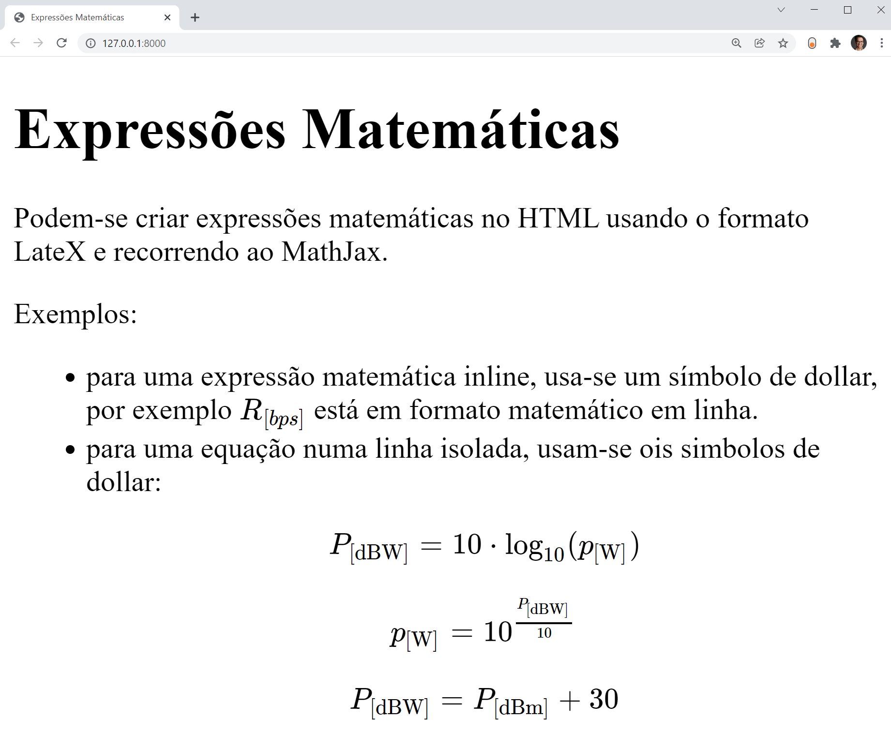

# matematica

* É possível criar expressões matemáticas numa página HTML renderizada em Django, utilizando LateX.
* deve-se importar MathJax, no script:
```HTML
<script type="text/javascript" id="MathJax-script" async
    src="https://cdn.jsdelivr.net/npm/mathjax@3.0.0/es5/tex-mml-chtml.js">
  </script>
```
* As expressões em Latex devem estar entre etiquetas `$$`
* Veja o exemplo em [index.html](https://github.com/CR-21-22/matematica/blob/main/matematica/templates/calculadora/index.html) que renderizado fica como em baixo.


